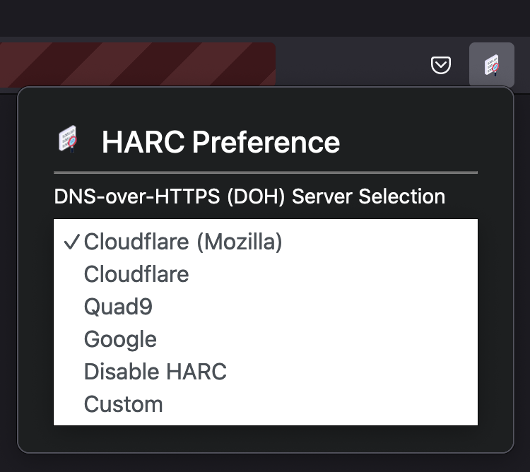
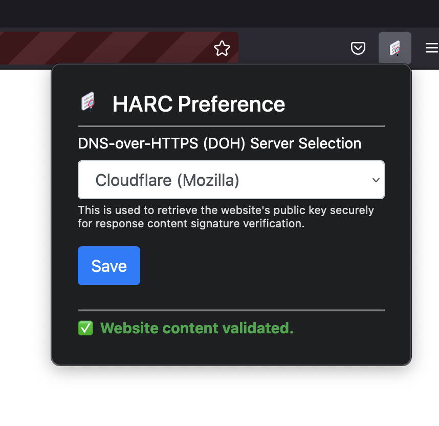
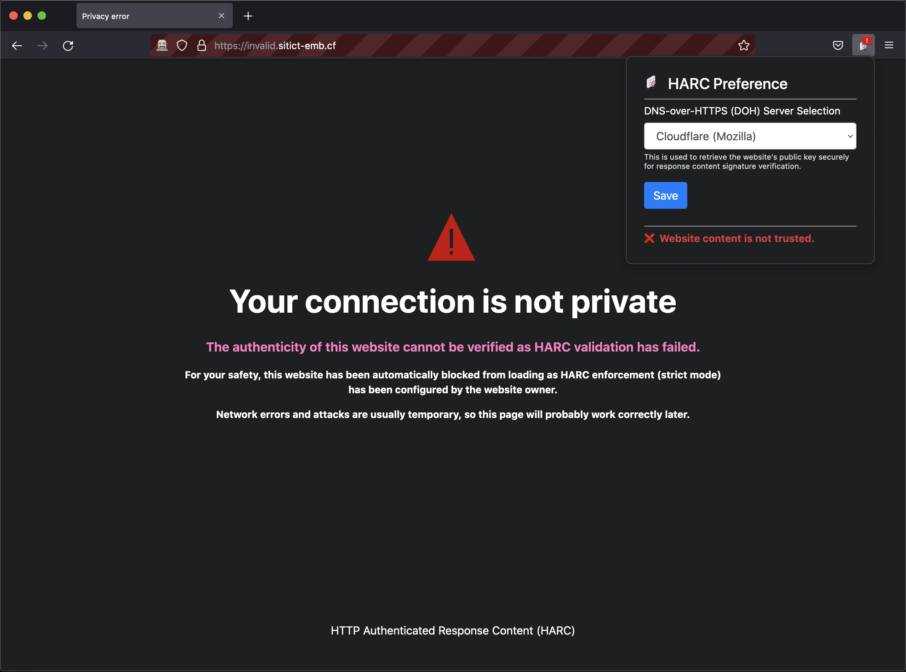

# HARC Browser Extension

This is the browser extension for verifying incoming HTTP responses signed by HARC Proxy Server.

## Setup Instructions

This section covers the setup instructions for HARC Browser Extension.

### Dependencies

[Node](https://nodejs.org/en/) and the Node Package Manager (npm) is required to build the application from source. It can be installed using [Node Version Manager (nvm)](https://github.com/nvm-sh/nvm).

Additional Node packages are required to build and run the application from source. Use the command `npm install` to install the necessary packages.

[Mozilla Firefox](https://www.mozilla.org/en-US/firefox/new/) Browser is required to run the extension.

### Building from source

Run the command `npm run build` to build the distributable extension package. The package will be available under the `web-ext-artifacts/` directory.

### Running from source

Run the command `npm run firefox` to install and run the extension on Mozilla Firefox Browser for development and testing. Alternatively, to install and run the extension on [Firefox Browser Developer Edition](https://www.mozilla.org/en-US/firefox/developer/), run the command `npm run firefox-dev`.

## Usage Instructions

The extension requires minimal configuration from the user and validation operations are done transparently. Users can configure the DNS-over-HTTPS (DoH) server to use by opening the extension's popup window (clicking on the extension icon), and selecting the preferred DoH server in the dropdown menu. Alternatively, the user can specify their own DoH server to use or disable HARC through the same dropdown.

The popup window also displays the HARC validation state of the resource in the current tab.

A block page may be displayed if HARC validation fails.

## Resources subjected to HARC validation

The HARC Browser Extension currently validates the following resources:

- Main document (the primary requested resource of the browser tab)
- Images
- Fonts

Cascading Stylesheets (CSS) and JavaScript (JS) files are not validated by HARC. Instead, [Subresource Integrity (SRI)](https://developer.mozilla.org/en-US/docs/Web/Security/Subresource_Integrity) should be used to validate the authenticity of those resources.
